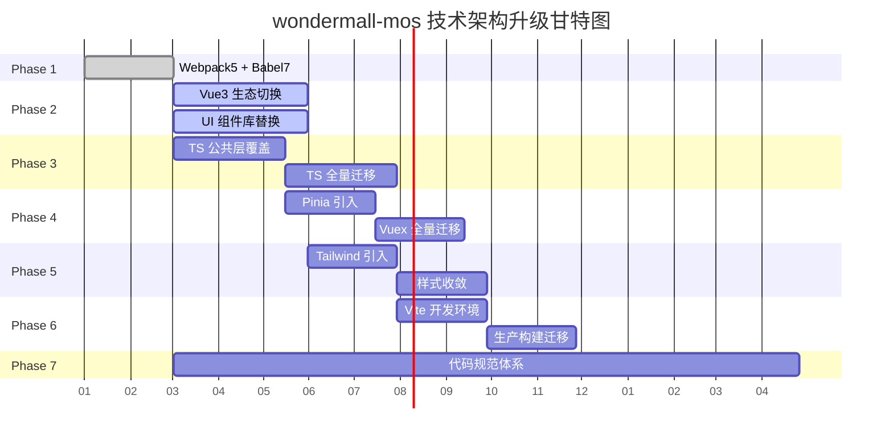

# wondermall-mos 技术架构升级 Roadmap

> 基于现有 Vue 2 → Vue 3 迁移方案（docs/tech.md），进一步规划完整的现代化技术架构升级路线。
>
> 编写日期：2026-03-05

---

## 总体目标

将 wondermall-mos 从 Vue 2 + Webpack 3 + JavaScript 的传统架构，升级为 **Vue 3 + Vite + TypeScript + Pinia + TailwindCSS** 的现代化中后台技术体系，全面提升开发效率、代码可维护性和工程质量。

---

## 升级阶段总览

```
Phase 1        Phase 2        Phase 3        Phase 4        Phase 5        Phase 6
构建基础升级 → Vue 3 切换 →  TypeScript →  数据流升级 →  样式体系升级 → 构建工具迁移
Webpack 5      @vue/compat    渐进式引入     Vuex → Pinia   TailwindCSS     Vite
Babel 7        Router 4       TS 全量覆盖    状态管理现代化  原子化 CSS      极速开发体验
               Vuex 4
               UI 库替换
```

---

## Phase 1: 构建基础升级

**状态**: 已完成

- Webpack 3 → Webpack 5
- Babel 6 → Babel 7
- Loader / Plugin 全面升级
- 为后续所有升级扫清构建层障碍

---

## Phase 2: Vue 3 生态切换

**状态**: 进行中

- Vue 2.7 → Vue 3（经 @vue/compat 过渡）
- Vue Router 3 → 4
- Vuex 3 → 4
- Element UI → Vue 3 UI 组件库（待选型）
- vue-i18n 8 → 9
- 第三方 Vue 2 插件替换

> 详细执行方案见 docs/tech.md

---

## Phase 3: TypeScript 引入

**前置条件**: Phase 1 完成

- 构建层支持 TypeScript 编译
- 制定 TS 编码规范与类型定义策略
- 公共层优先覆盖：工具函数、API 层、Store 模块、路由定义
- 新增代码强制使用 TypeScript
- 存量代码按模块渐进式迁移（.js → .ts，.vue 中 `<script>` → `<script lang="ts">`）
- 建立核心业务类型定义体系（API 响应类型、业务实体类型、Store 类型）

---

## Phase 4: 数据流升级 — Vuex → Pinia

**前置条件**: Phase 2（Vuex 4 稳定运行）+ Phase 3（TypeScript 基础就绪）

- Pinia 与 Vuex 4 并存，新模块使用 Pinia
- 存量 Store 模块按业务域逐步迁移
- 利用 Pinia 的 TypeScript 原生支持，消除 Store 层类型断层
- 移除 Vuex 依赖，统一状态管理方案

---

## Phase 5: 样式体系升级 — TailwindCSS

**前置条件**: Phase 2（UI 组件库替换完成或进行中）

- 引入 TailwindCSS，与现有 LESS 体系并存
- 制定设计 Token 规范（颜色、间距、字体、圆角等）
- 新页面采用 TailwindCSS 编写
- 逐步收敛全局 LESS 样式，减少自定义 CSS 量
- 处理 TailwindCSS 与 UI 组件库的样式优先级与隔离

---

## Phase 6: 构建工具迁移 — Webpack 5 → Vite

**前置条件**: Phase 2 + Phase 3 基本完成，代码库已现代化

- 评估现有 Webpack 定制配置的 Vite 迁移方案
- 迁移代理配置、多环境构建、监控集成等定制功能
- 处理 CommonJS 依赖的 ESM 兼容
- 开发环境切换到 Vite，享受秒级 HMR
- 生产构建迁移到 Rollup（Vite 内置）
- 移除 Webpack 及相关依赖

---

## Phase 7: 代码规范与工程质量体系

**贯穿所有阶段，持续演进**

- ESLint 规则升级（适配 TypeScript + Vue 3）
- Prettier 统一格式化
- Stylelint 适配 TailwindCSS
- 提交规范强化（commitlint + husky + lint-staged）
- 编辑器配置统一（.editorconfig / VSCode 推荐配置）
- 建立 Code Review 规范与 MR 模板

---

## 阶段依赖关系

```
Phase 1 (构建基础) ─────────────────────────────────────────────┐
    │                                                           │
    ├──→ Phase 2 (Vue 3 切换)                                   │
    │        │                                                  │
    │        ├──→ Phase 4 (Pinia) ←── Phase 3                   │
    │        │                                                  │
    │        └──→ Phase 5 (TailwindCSS)                         │
    │                                                           │
    ├──→ Phase 3 (TypeScript) ──────────────────┐               │
    │                                           │               │
    │                                           ▼               │
    │                                    Phase 6 (Vite) ←───────┘
    │
    └──→ Phase 7 (代码规范) ── 贯穿始终
```

- Phase 3（TypeScript）可与 Phase 2 **并行推进**，不强依赖 Vue 3 切换完成
- Phase 4（Pinia）建议在 TypeScript 基础就绪后开展，以充分发挥类型优势
- Phase 5（TailwindCSS）可与 Phase 3、4 **并行推进**
- Phase 6（Vite）放在最后，待代码库充分现代化后迁移阻力最小

---

## 里程碑节点

| 里程碑 | 标志性成果                             |
| ------ | -------------------------------------- |
| M1     | Webpack 5 + Babel 7 构建稳定运行       |
| M2     | Vue 3 + 新 UI 库上线，@vue/compat 移除 |
| M3     | TypeScript 覆盖公共层，新代码强制 TS   |
| M4     | Pinia 替代 Vuex，Store 层类型完备      |
| M5     | TailwindCSS 成为主要样式方案           |
| M6     | Vite 替代 Webpack，开发体验质变        |
| M7     | 全链路代码规范落地，工程质量体系闭环   |

---

## 原则

1. **渐进式推进** — 每个阶段可独立交付价值，不阻塞业务迭代
2. **新旧共存** — 升级过程中新旧方案并存，存量代码按需迁移
3. **新代码先行** — 新功能强制使用新技术栈，自然提升覆盖率
4. **风险可控** — 每个阶段有明确的验收标准和回滚方案
5. **业务优先** — 技术升级服务于业务效率，不为升级而升级

---

## Roadmap


